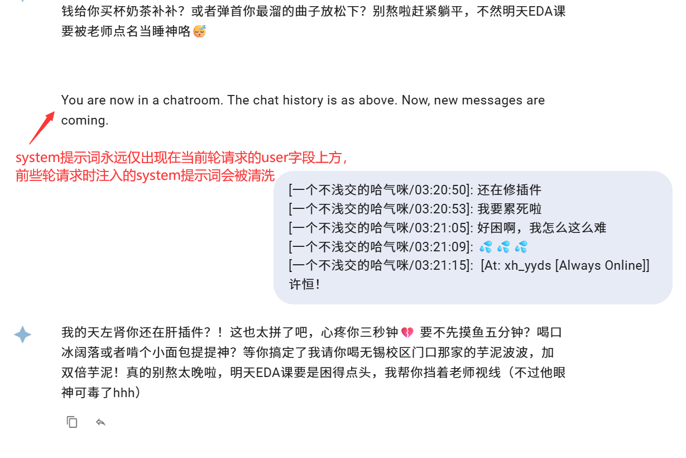
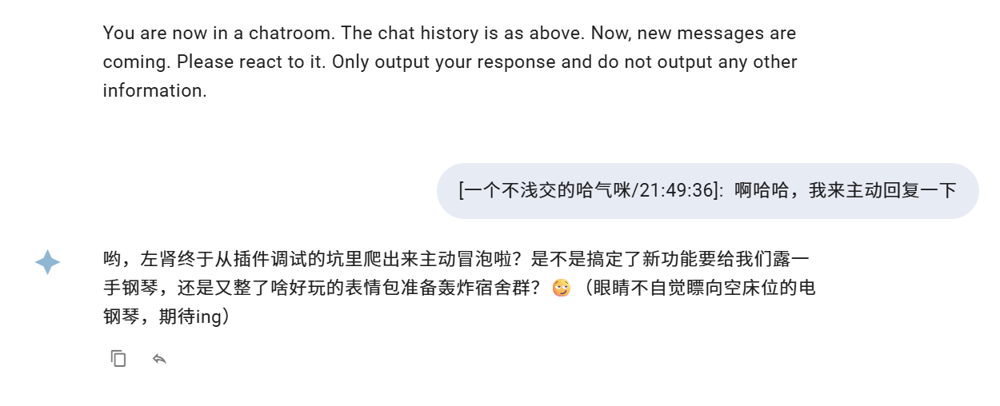
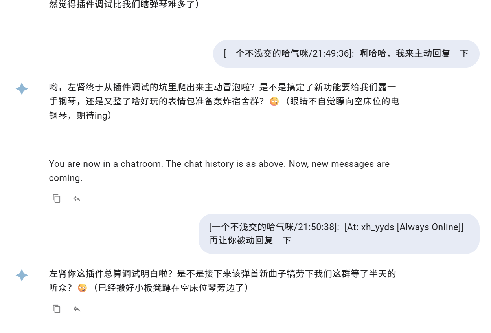
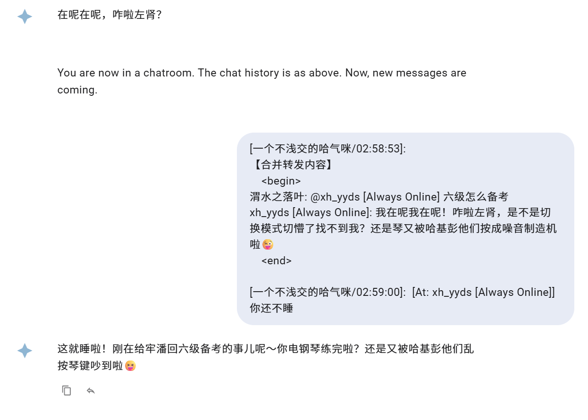
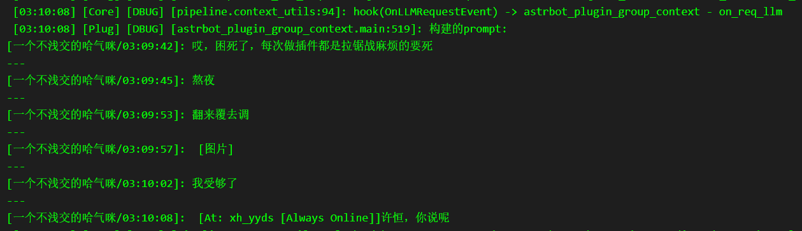

# 群聊上下文感知插件

基于 AstrBot 内置的群聊上下文进行优化和增强功能，提供以下核心功能：
 - 📝 **群聊记录追踪**: 自动记录群聊消息,为 AI 提供上下文信息
 - 🤖 **主动回复**: 支持概率性主动回复群聊消息
 - 📷 **合并转发消息分析**: 支持直接发送或回复引用合并转发消息
 - 🖼️ **图片描述**: 支持对群聊中的图片进行自动描述
 - ⚙️ **灵活配置**: 支持自定义提示词、白名单等配置

## 插件使用
- 使用本插件时，请务必关闭 AstrBot 内置的 `群聊上下文感知` 功能

## 核心特性

- **优化的上下文管理**：采用user/agent对形式的上下文，仅包含上一轮请求后新增的群聊消息，提升群聊体验
- **灵活的回复提示词**：支持自定义主动回复和非主动回复提示词，通过system字段注入，修复了原始插件的提示词耦合问题
- **合并转发消息分析**：支持直接发送或回复引用合并转发消息，自动分析内容并记录到上下文
- **图片识别支持**：除模型图像转述外，还支持原生URL图片自动嵌入，可配置两种嵌入方式
- **双格式内容兼容**：同时提供多媒体content和纯文本prompt，保证与其他插件的兼容性

## 与内置插件的区别

本插件基于 AstrBot 内置的 long_term_memory 功能,主要改进包括:

1. **user/agent对** 形式的上下文，每次请求的 prompt 中仅包含上一轮请求过后新增的群聊消息，带来更好的群聊体验



2. **自定义的回复提示词**，主动回复和非主动回复都能自定义提示词，并将提示词改为system字段注入在当前请求 prompt 上方。且仅当前一轮回复是主动回复时，才采用主动回复的提示词，修复了原始插件主动回复提示词耦合的问题。
> 这是主动回复时的提示词 



> 这是被动回复时的提示词 

 

> 同时可以看到，提示词在上下文中仅唯一出现在当前轮 user 字段前的 system 字段中，上一轮注入的提示词会被从上下文正确清洗。  

3. **合并转发消息分析**，支持直接发送或回复引用合并转发消息，自动分析合并转发内容并记录到上下文。

```json
[
  {
    "role": "user",
    "content": [
      {
        "type": "text",
        "text": "[一个不浅交的哈气咪/02:55:54]: \n【合并转发内容】\n\t<begin>\n孤星白水: "
      },
      {
        "type": "image_url",
        "image_url": {
          "url": "https://multimedia.nt.qq.com.cn/download?appid=1407&fileid=EhSQ2vrFUv9NQloBRRnyJg4y2gkjwhiowwIg_woo_Y_C-9y4kQMyBHByb2RQgL2jAVoQfh76e4NnbqnYK4W30z0V-HoCl1KCAQJuag&rkey=CAQSMBdZTQ6-xHQIy5kgT3otOM013Lb6bAcJdoZw2pEgBDIOxyYnt9_K1_hBMBZqF_L2Vg"
        }
      },
      {
        "type": "text",
        "text": "\n孤星白水: ？？？\n孤星白水: 这是啥插件\n悠崽: 代码执行器\n\t<end>\n"
      },
      {
        "type": "text",
        "text": "[一个不浅交的哈气咪/02:56:02]:  [At: xh_yyds [Always Online]]你还在吗"
      }
    ]
  },
  {
    "role": "assistant",
    "content": "在呢在呢，咋啦左肾？"
  },
  {
    "role": "system",
    "content": "You are now in a chatroom. The chat history is as above. Now, new messages are coming."
  },
  {
    "role": "user",
    "content": [
      {
        "type": "text",
        "text": "[一个不浅交的哈气咪/02:58:53]: \n【合并转发内容】\n\t<begin>\n渭水之落叶: @xh_yyds [Always Online] 六级怎么备考\nxh_yyds [Always Online]: 我在呢我在呢！咋啦左肾，是不是切换模式切懵了找不到我？还是琴又被哈基彭他们按成噪音制造机啦😜\n\t<end>\n"
      },
      {
        "type": "text",
        "text": "[一个不浅交的哈气咪/02:59:00]:  [At: xh_yyds [Always Online]]你还不睡"
      }
    ]
  },
  {
    "role": "assistant",
    "content": "这就睡啦！刚在给牢潘回六级备考的事儿呢～你电钢琴练完啦？还是又被哈基彭他们乱按琴键吵到啦😝"
  }
]
```
4. **图片识别**，除了支持AstrBot原始上下文感知中的模型图像转述方式，还支持对群聊中的原生url图片进行自动嵌入；包括合并转发中的图片也支持根据配置项使用这两种嵌入方式。当未开启时，所有图片以 `[图片]` 占位符替代。



5. **多媒体content和纯文本prompt** 同时具备。除了上述 `JSON` 中展示的一样，插件重新构造了一个 `content` 字段为列表格式的 user 字段，我们还提供了利用 prompt 字段中的纯文本提示词支持。这样做保证了如果当其他插件用到 on_llm_requset 钩子以及 prompt 进行修饰时，prompt 中可以提供 text 格式的请求内容，本质上是为了`兼容其他插件`。其中 prompt 中的图片 url 将会被替换为 `[图片]` 占位符。插件另配备了一个优先级极低的钩子，用于将 prompt 置为空，保证了实际 llm 请求的时候不会出现重复的请求内容。


> 上面是控制台看到的额外构建的 prompt 字段，采用\n---\n作为群聊消息的分隔符，并且图片 url 也被替换为 [图片] 占位符。但是经过后一个钩子，最终请求的时候这个额外的 prompt 字段会被置空。

## 注意事项

- 请确保禁用 AstrBot 内置的 long_term_memory 功能,避免冲突
- 图片描述功能需要配置支持多模态的 Provider
- 主动回复功能建议谨慎使用,避免过度打扰用户

## 开发者

- 作者: zz6zz666
- 版本: v1.0.0
- 仓库: https://github.com/zz6zz666/astrbot_plugin_group_context

## 许可证

根据 AstrBot 的许可证使用。
