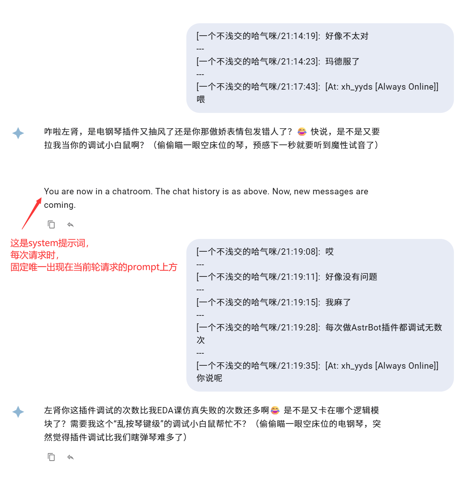

# 群聊上下文感知插件

优化 AstrBot 内置的群聊上下文增强功能,提供群聊记录追踪、主动回复、图片描述等功能。

## 功能特性

- 📝 **群聊记录追踪**: 自动记录群聊消息,为 AI 提供上下文信息
- 🤖 **主动回复**: 支持概率性主动回复群聊消息
- 🖼️ **图片描述**: 支持对群聊中的图片进行自动描述
- ⚙️ **灵活配置**: 支持自定义提示词、白名单等配置

## 安装

将插件文件夹复制到 AstrBot 的插件目录即可。

## 配置说明

### 配置项

- `group_message_max_cnt`: 群聊消息最大记录条数 (默认: 300)
- `image_caption`: 是否启用图片描述功能 (默认: false)
- `image_caption_provider_id`: 用于图片描述的 Provider ID (留空则使用当前正在使用的 Provider)
- `enable_active_reply`: 是否启用主动回复功能 (默认: false)
- `ar_method`: 主动回复触发方式 (默认: "possibility_reply")
- `ar_possibility`: 主动回复概率,范围 0.0-1.0 (默认: 0.1)
- `active_reply_prompt`: 主动回复自定义提示词 (可选)
- `normal_reply_prompt`: 一般回复自定义提示词 (可选)
- `ar_whitelist`: 主动回复白名单,群号或用户ID列表 (留空表示不限制)

## 与内置插件的区别

本插件基于 AstrBot 内置的 long_term_memory 功能,主要改进包括:

1. **user/agent对** 形式的上下文，每次请求的 prompt 中仅包含上一轮请求过后新增的群聊消息，带来更好的群聊体验

## 注意事项

- 请确保禁用 AstrBot 内置的 long_term_memory 功能,避免冲突
- 图片描述功能需要配置支持多模态的 Provider
- 主动回复功能建议谨慎使用,避免过度打扰用户

## 开发者

- 作者: zz6zz666
- 版本: v1.0.0
- 仓库: https://github.com/zz6zz666/astrbot_plugin_group_context

## 许可证

根据 AstrBot 的许可证使用。
